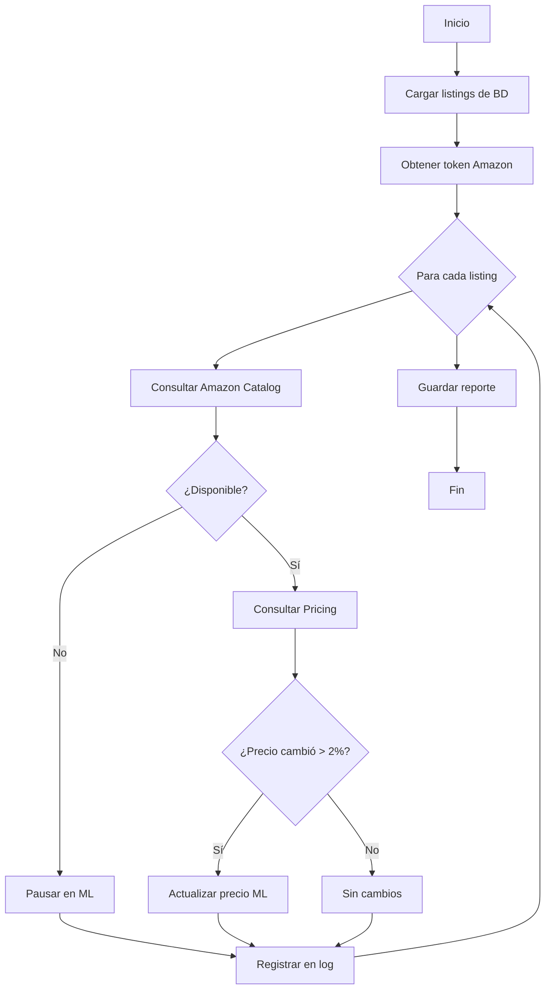

# Sistema de Sincronización Automática Amazon → MercadoLibre

## 📋 Descripción

Sistema automatizado que sincroniza las publicaciones de MercadoLibre con el estado y precios de los productos en Amazon cada 3 días.

## 🎯 Funcionalidades

### 1. Detección de Productos Descontinuados
- **Verifica disponibilidad** de cada ASIN en Amazon
- **Pausa automáticamente** las publicaciones de ML si:
  - El producto ya no existe en Amazon (404)
  - El producto no tiene ofertas disponibles
  - El producto aún no ha sido lanzado (fecha futura)

### 2. Sincronización de Precios
- **Consulta precios** en tiempo real desde Amazon
- **Calcula nuevo precio** de ML con el markup configurado
- **Actualiza automáticamente** si el cambio es > 2%
- **Registra cambios** en la base de datos

### 3. Sistema de Logs
- Log detallado de cada sincronización
- Estadísticas completas de cambios
- Historial de acciones realizadas

## 🗂️ Arquitectura

```
sync_amazon_ml.py
├── Consulta Amazon SP-API
│   ├── Catalog Items API (disponibilidad)
│   └── Product Pricing API (precios)
├── Compara con Base de Datos
│   └── storage/listings_database.db
└── Actualiza MercadoLibre
    ├── Pausa publicaciones
    └── Actualiza precios
```

## 📦 Archivos del Sistema

| Archivo | Descripción |
|---------|-------------|
| `sync_amazon_ml.py` | Script principal de sincronización |
| `setup_sync_cron.sh` | Instalador del cron job |
| `logs/sync/sync_*.json` | Logs de cada ejecución |
| `storage/listings_database.db` | Base de datos SQLite |

## 🚀 Instalación

### 1. Verificar dependencias

```bash
# Instalar dependencias necesarias
pip install python-dateutil requests python-dotenv
```

### 2. Configurar variables de entorno

Asegúrate de que `.env` contenga:

```bash
# Amazon SP-API
LWA_CLIENT_ID=amzn1.application-oa2-client.XXXXXXXX
LWA_CLIENT_SECRET=amzn1.oa2-cs.v1.XXXXXXXX
REFRESH_TOKEN=Atzr|IwEBIXXXXXXX

# MercadoLibre
ML_ACCESS_TOKEN=APP_USR-XXXXXXXX

# Configuración de precios
PRICE_MARKUP_PERCENT=40  # 40% de markup sobre Amazon
```

### 3. Instalar el cron job

```bash
# Ejecutar el instalador (interactivo)
./setup_sync_cron.sh
```

O agregar manualmente al crontab:

```bash
# Editar crontab
crontab -e

# Agregar esta línea (ejecuta cada 3 días a las 9 AM)
0 9 */3 * * cd /Users/felipemelucci/Desktop/revancha && ./venv/bin/python3 sync_amazon_ml.py >> logs/sync/sync_cron.log 2>&1
```

## 🔧 Configuración

### Umbral de Cambio de Precio

Por defecto, solo actualiza precios si la diferencia es mayor al 2%. Modificar en `sync_amazon_ml.py`:

```python
PRICE_CHANGE_THRESHOLD = 2.0  # Cambiar a 1.0 para ser más sensible
```

### Frecuencia de Ejecución

Modificar la expresión cron:

```bash
# Cada día a las 9 AM
0 9 * * *

# Cada 2 días a las 9 AM
0 9 */2 * *

# Cada semana (lunes a las 9 AM)
0 9 * * 1
```

## 📊 Funcionamiento Detallado

### Proceso de Sincronización



### Estados de Productos en Amazon

| Estado | Descripción | Acción en ML |
|--------|-------------|--------------|
| `active` | Producto disponible con precio | Actualizar precio si cambió |
| `unavailable` | Sin ofertas disponibles | Pausar publicación |
| `not_found` | ASIN no existe (404) | Pausar publicación |
| `unreleased` | Fecha de lanzamiento futura | Pausar publicación |
| `error` | Error al consultar | Sin acción, reportar |

### Cálculo de Precios

```python
# Precio Amazon: $50 USD
# Markup configurado: 40%

nuevo_precio_ml = precio_amazon * (1 + markup/100)
nuevo_precio_ml = 50 * 1.40
nuevo_precio_ml = $70 USD
```

## 📝 Ejemplos de Uso

### Ejecución Manual

```bash
# Ejecutar sincronización una vez
cd /Users/felipemelucci/Desktop/revancha
./venv/bin/python3 sync_amazon_ml.py
```

### Ver Logs

```bash
# Último log de sincronización
cat logs/sync/sync_cron.log | tail -100

# Ver logs JSON de una sincronización específica
cat logs/sync/sync_20250102_090000.json | jq .
```

### Verificar Cron Job

```bash
# Ver cron jobs activos
crontab -l | grep sync_amazon_ml

# Eliminar cron job
crontab -l | grep -v sync_amazon_ml | crontab -
```

## 📈 Formato del Log JSON

Cada ejecución genera un archivo JSON con:

```json
{
  "timestamp": "2025-01-02T09:00:00",
  "statistics": {
    "total": 50,
    "paused": 5,
    "price_updated": 12,
    "no_change": 30,
    "errors": 3
  },
  "changes": [
    {
      "item_id": "MLM123456",
      "asin": "B0ABC123XYZ",
      "action": "price_updated",
      "success": true,
      "message": "Precio actualizado: $50.0 → $55.5 USD",
      "old_price": 50.0,
      "new_price": 55.5,
      "amazon_status": {
        "available": true,
        "price": 39.64,
        "buyable": true,
        "status": "active"
      }
    }
  ]
}
```

## 🔍 Monitoreo y Alertas

### Revisar Estadísticas

```bash
# Contar sincronizaciones exitosas
grep -c "✅ Sincronización completada" logs/sync/sync_cron.log

# Ver errores recientes
grep "❌" logs/sync/sync_cron.log | tail -20
```

### Crear Alertas (Opcional)

Agregar notificación al final del script:

```python
# En sync_amazon_ml.py, al final de main()
if stats["errors"] > 10:
    # Enviar email o notificación
    print(f"⚠️ ALERTA: {stats['errors']} errores detectados")
```

## 🛠️ Solución de Problemas

### Error: "Faltan credenciales de Amazon"

```bash
# Verificar que .env tiene las variables
cat .env | grep -E "(LWA_CLIENT_ID|REFRESH_TOKEN)"

# Recargar variables
source .env
```

### Error: "No se encontró la base de datos"

```bash
# Inicializar la base de datos
python3 save_listing_data.py
```

### Listings no se actualizan

1. Verificar que los listings tienen `item_id` en la BD:
   ```bash
   sqlite3 storage/listings_database.db "SELECT COUNT(*) FROM listings WHERE item_id IS NOT NULL;"
   ```

2. Verificar permisos del token ML:
   ```bash
   curl -H "Authorization: Bearer $ML_ACCESS_TOKEN" https://api.mercadolibre.com/users/me
   ```

3. Revisar logs de errores:
   ```bash
   tail -100 logs/sync/sync_cron.log | grep "⚠️\|❌"
   ```

## 🔐 Seguridad

- **No compartir** el archivo `.env` (contiene tokens sensibles)
- **Rotar tokens** regularmente (cada 6 meses)
- **Limitar permisos** del cron a solo lectura/escritura de precios

## 📚 APIs Utilizadas

- **Amazon SP-API**:
  - [Catalog Items API 2022-04-01](https://developer-docs.amazon.com/sp-api/docs/catalog-items-api-v2022-04-01-reference)
  - [Product Pricing API v0](https://developer-docs.amazon.com/sp-api/docs/product-pricing-api-v0-reference)

- **MercadoLibre API**:
  - [Items Management](https://developers.mercadolibre.com/en_us/items-and-searches)
  - [Global Selling](https://developers.mercadolibre.com/en_us/global-selling)

## 🆘 Soporte

Para reportar problemas o sugerencias:

1. Revisar los logs en `logs/sync/`
2. Verificar la configuración en `.env`
3. Ejecutar manualmente para ver errores en detalle
4. Revisar la documentación de las APIs

## 📜 Changelog

### v1.0.0 (2025-01-02)
- ✨ Implementación inicial
- 🔄 Sincronización automática cada 3 días
- 💰 Actualización proporcional de precios
- ⏸️ Pausa automática de productos descontinuados
- 📊 Sistema de logs y estadísticas
